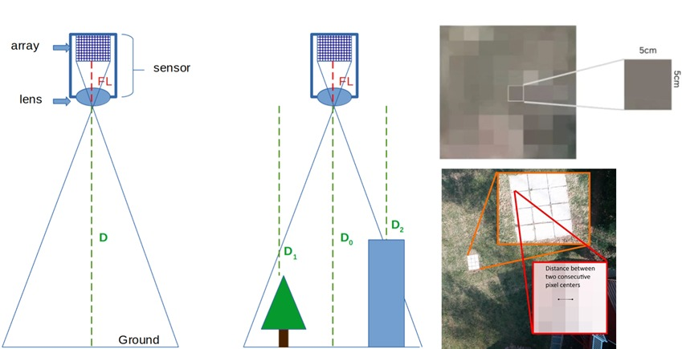

# GeoAI–Deep Learning–Based Rooftop Solar Potential Estimation

This repository presents a research-oriented GeoAI framework for estimating rooftop solar photovoltaic (PV) potential in dense urban environments. The framework integrates large-scale geospatial modeling with deep learning–based rooftop segmentation to identify shadow-free, usable rooftop areas for solar energy deployment.

---

## Methodology Overview
The proposed framework consists of two tightly coupled components: large-scale shadow modeling and deep learning–based rooftop analysis.

### 1. Large-Scale Shadow Modeling Using 2.5D Vector Ray Tracing

A computationally efficient **2.5D vector-based ray-tracing approach** was developed and applied to over **600,000 buildings** to model inter-building shadow interactions. The method leverages physics-based parametric representations of ray propagation derived from the laws of optics, enabling realistic simulation of solar obstruction effects in complex urban morphologies.

This shadow modeling framework identifies rooftops that remain unshaded during critical solar hours and is designed to be scalable for city-wide and metropolitan-level solar energy assessments.

  

  <em>Conceptual illustration of the 2.5D vector raycasting approach for modeling inter-building shadows and identifying shaded and unshaded rooftop regions.</em>

### 2. Deep Learning–Based Rooftop Segmentation

For rooftops identified as suitable through shadow analysis, transfer learning with a deep convolutional neural network (DCNN) is applied to delineate usable rooftop areas. A U-Net architecture with a ResNet50 encoder is used to segment rooftop surfaces from high-resolution satellite imagery and identify zones suitable for solar panel installation.

The model leverages residual connections and multi-scale feature extraction to capture both fine-grained spatial details and high-level rooftop characteristics. This enables robust segmentation across diverse rooftop shapes, materials, and urban contexts. The trained model achieved a validation Intersection-over-Union (IoU) of 0.76 and an overall accuracy of 93%, indicating strong generalization performance.

  
 
 <em>Example segmentation results showing identification of usable rooftop areas from satellite imagery.</em> 
 
  
 
 <em>Training and validation performance of the deep learning model.</em> 

---

### 3. Rooftop Area Estimation Using GSD

Usable rooftop area is derived directly from the segmentation output using the Ground Sampling Distance (GSD) of the satellite imagery. Each segmented pixel represents a fixed real-world surface area defined by the image resolution. By aggregating pixels classified as usable rooftop, the framework converts deep learning outputs into physically meaningful rooftop area estimates, ensuring consistency between image-based analysis and geospatial energy modeling.

   
 
 <em>Conceptual illustration of GSD-based pixel-to-area conversion and photogrammetric interpretation of rooftop surfaces.</em> 

### 4. Solar Potential Assessment

The shadow-free usable rooftop areas are subsequently used to estimate rooftop solar PV potential by incorporating standard assumptions related to panel efficiency, installation density, and local solar irradiance conditions. This enables robust rooftop-level and city-wide solar potential assessment suitable for urban energy planning and policy support.

  
 
 <em>Workflow for rooftop-level and city-wide solar potential assessment based on usable rooftop area.</em> 

## Data Sources
- High-resolution satellite imagery (Google Earth)
- Building footprint and height data from RAJUK Detailed Area Plan (2016-35)
- Solar geometry and irradiance modeling using pvlib

---

## Tools and Technologies
- Python, GeoPandas, Shapely, Rasterio
- TensorFlow / Keras
- ArcGIS / QGIS for validation and spatial analysis
- pvlib for solar geometry modeling

---

## Key Contributions
- Physics-aware, scalable shadow modeling using 2.5D vector ray tracing
- Integration of GeoAI and deep learning for rooftop solar assessment
- Resolution-consistent rooftop area estimation using GSD
- Application to a dense megacity-scale urban environment

---

## Citation
If you use this work, please cite:

> Hossain, K. R., Haque, L., & Hossain, D. (2025). GeoAI Driven Solar Energy Potential Assessment in Dhaka City Corporation Region Using 2.5D Raytracing for Shadow Analysis, Transfer Learning with Deep Convolutional Neural Network (DCNN)  for Rooftop Segmentation and K-Means Clustering for Zonal Classification. 

---

